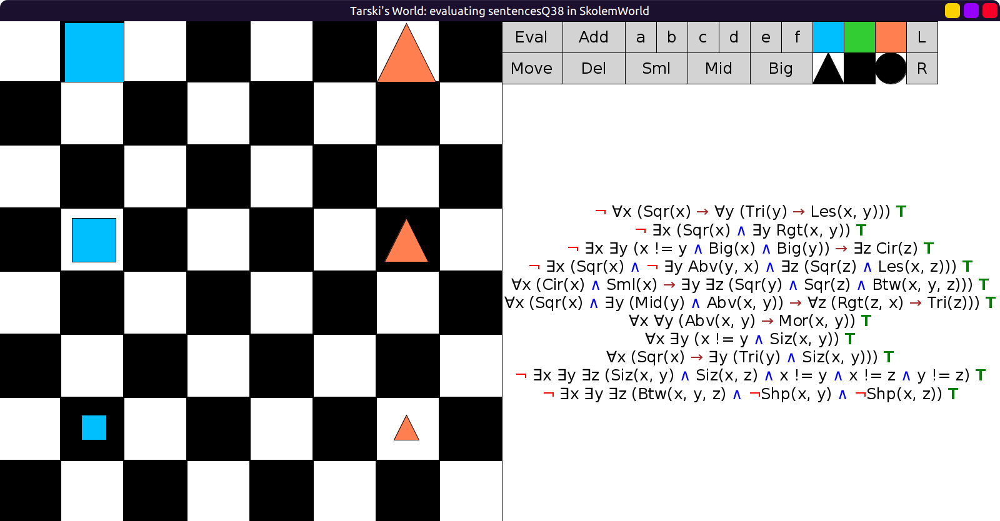
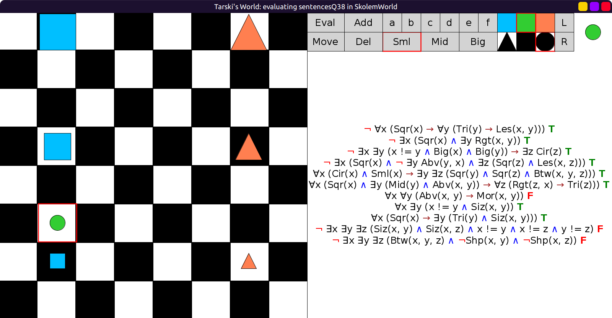
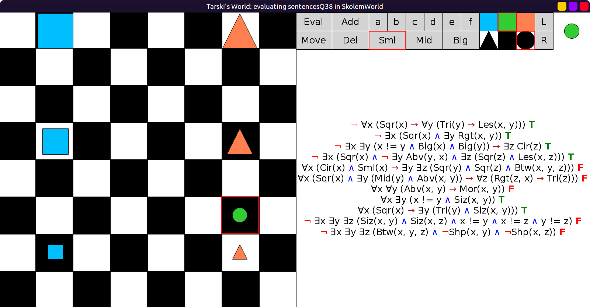
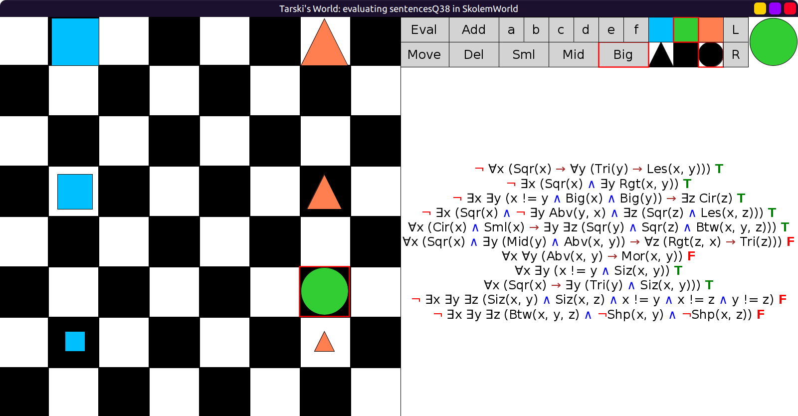

# 38 - solution

```scala
val sentencesQ38 = Seq(
  fof"¬ ∀x (Sqr(x) → ∀y (Tri(y) → Les(x, y)))",         // Not every square is smaller than every triangle
  fof"¬ ∃x (Sqr(x) ∧ ∃y Rgt(x, y))",                    // No square is to the right of anything
  fof"¬(∃x ∃y (x != y ∧ Big(x) ∧ Big(y))) → ∃z Cir(z)", // There is a circle unless there are at least two big objects
  fof"¬ ∃x (Sqr(x) ∧ ¬ ∃y Abv(y, x) ∧ ∃z (Sqr(z) ∧ Les(x, z)))", // No square with nothing above it is smaller than another square.
  fof"∀x (Cir(x) ∧ Sml(x) → ∃y ∃z (Sqr(y) ∧ Sqr(z) ∧ Btw(x, y, z)))", // If any circle is small, then it is between two squares.
  fof"∀x (Sqr(x) ∧ ∃y (Mid(y) ∧ Abv(x, y)) → ∀z (Rgt(z, x) → Tri(z)))", // If a square is above something medium, then it has nothing to its right except for triangles.
  fof"∀x ∀y (Abv(x, y) → Mor(x, y))",         // The further above a thing is, the bigger it is.
  fof"∀x ∃y (x != y ∧ Siz(x, y))",            // Everything is the same size as something else.
  fof"∀x (Sqr(x) → ∃y (Tri(y) ∧ Siz(x, y)))", // Every square has a triangle of the same size to its right.
  fof"¬ ∃x ∃y ∃z (Siz(x, y) ∧ Siz(x, z) ∧ x != y ∧ x != z ∧ y != z)", // Nothing is the same size as two (or more) other things.
  fof"¬ ∃x ∃y ∃z (Btw(x, y, z) ∧ ¬Shp(x, y) ∧ ¬Shp(x, z))" // Nothing is between objects of shapes other than its own.
)
```

Initial evaluation all true:



Add small circle between bottom two squares, 5 is still true:



Move the small circle between bottom two circles, 5 is now false:



Make the small circle big, 5 is true again:


