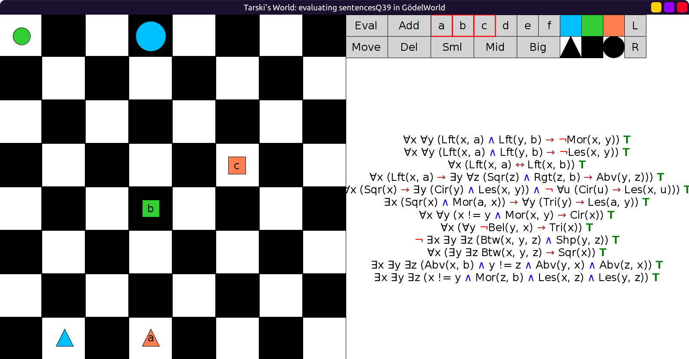

# 39 - solution

```scala
val sentencesQ39 = Seq(
  fof"∀x ∀y ((Lft(x, a) ∧ Lft(y, b)) → ¬Mor(x, y))", // Nothing to the left of `a` is bigger than everything to the left of `b`.
  fof"∀x ∀y ((Lft(x, a) ∧ Lft(y, b)) → ¬Les(x, y))", // Nothing to the left of `a` is smaller than anything to the left of `b`.
  fof"∀x (Lft(x, a) ↔ Lft(x, b))", // The same things are left of `a` as are left of `b`.
  fof"∀x (Lft(x, a) → ∃y ∀z((Sqr(z) ∧ Rgt(z, b)) → Abv(y, z)))", // Anything to the left of `a` is smaller than something that is in back of every square to the right of `b`.
  fof"∀x (Sqr(x) → ∃y (Cir(y) ∧ Les(x, y)) ∧ ¬ ∀u (Cir(u) → Les(x, u)))", // Every square is smaller than some circle but no square is smaller than every circle.
  fof"∃x (Sqr(x) ∧ Mor(a, x)) → ∀y (Tri(y) → Les(a, y))", // If a is bigger than some square then it is smaller than every triangle.
  fof"∀x ∀y ((x != y ∧ Mor(x, y)) → Cir(x))", // Only circles are bigger than everything else.
  fof"∀x (∀y ¬Bel(y,x) → Tri(x))",            // All objects with nothing below them are triangles.
  fof"¬ ∃x ∃y ∃z (Btw(x, y, z) ∧ Shp(y, z))", // Nothing is between two objects which are the same shape.
  fof"∀x (∃y ∃z Btw(x, y, z) → Sqr(x))",      // Nothing but a square is between two other objects.
  fof"∃x ∃y ∃z (Abv(x, b) ∧ y != z ∧ Abv(y, x) ∧ Abv(z, x))", // `b` has something behind it which has at least two objects behind it.
  fof"∃x ∃y ∃z (x != y ∧ Mor(z, b) ∧ Les(x, z) ∧ Les(y, z))" // More than one thing is Les than something bigger than `b`.
)
```


