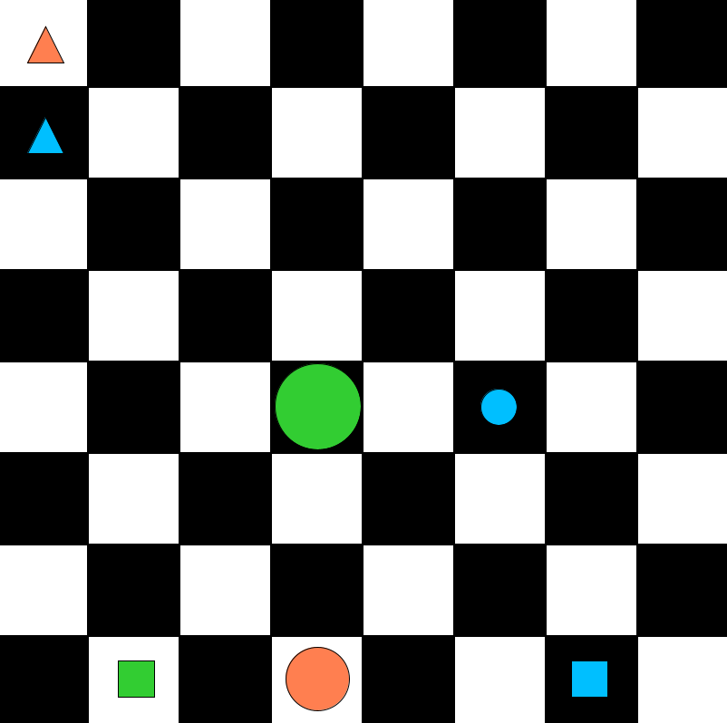
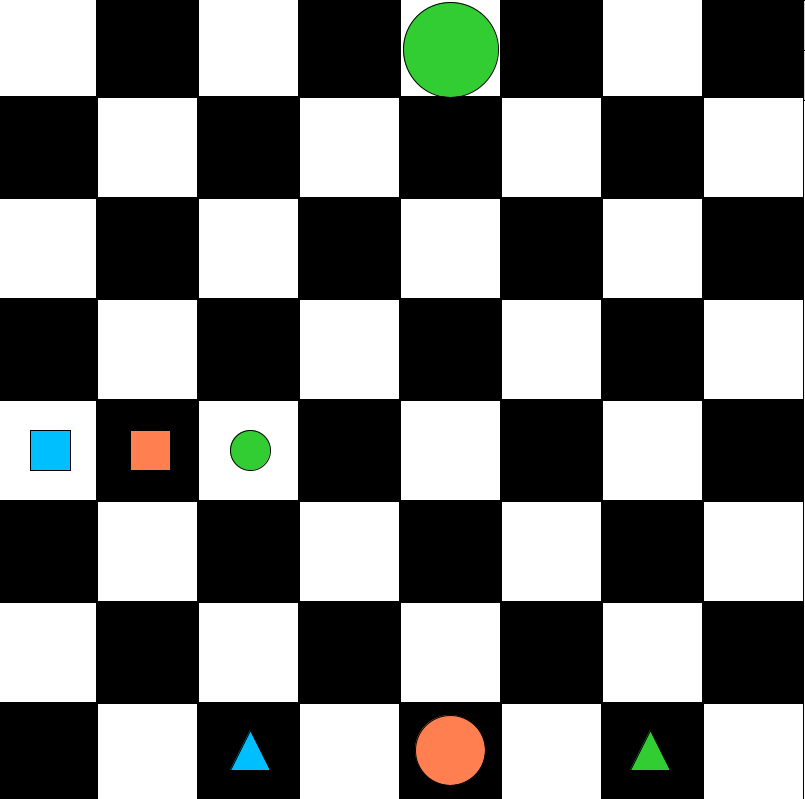

# 40 - Translating extended discourse

***In this example there is no code for you to run, but you'll do some translating.***

The problems of translation are much more difficult when we look
at extended discourse, where more than one sentence comes in.
This example will help you get a feeling for the difficulty.

- See `ReichenbachWorld1` and examine it:

    

- Check that all of the following discourse is true in this world:

    > There are (at least) two squares. There is something between them.
    > It is a mid circle. It is below a big circle.
    > These two are left of a small circle. There are two triangles.

- Do you see why it's true?
- Translate this discourse into a *single* first-order sentence.
- This single sentence is true in `ReichenbachWorld1`.
- Now see `ReichenbachWorld2` and examine it:

    

- The same sentence is false in this world. Do you see why?

- Now check that all of the following discourse is true in `ReichenbachWorld2`:

    > There are two triangles. There is something between them.
    > It is a mid circle. It is below a big circle.
    > There are two squares. These two are left of a small circle.

- Translate this into a *single* first-order sentence.
- This single sentence is true in `ReichenbachWorld2`.
- Now check that your translation is false in `ReichenbachWorld1`.
- However, note that the English sentences in the two discourses are in fact
  exactly the same; they have just been rearranged!
- The moral of this example is that the correct translation of a sentence
  into first-order logic (or any other language) can be very dependent on context.
