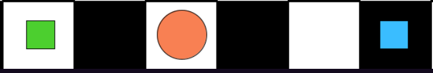
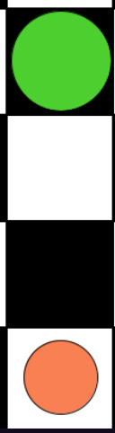
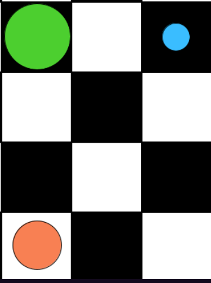
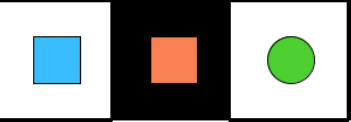
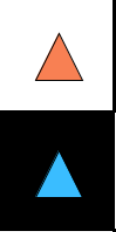
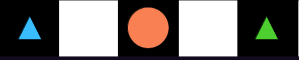
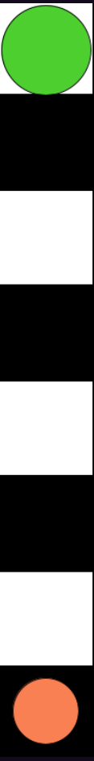
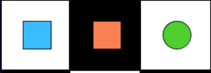

# 40 - solution

## First discourse

```scala
∃x ∃y ∃z (
  x != y ∧ Sqr(x) ∧ Sqr(y) ∧            // There are at least two squares.
  Btw(z, x, y) ∧                        // There is something between them.
  Mid(z) ∧ Cir(z) ∧                     // It is a mid circle.
  ∃u (
    Big(u) ∧ Cir(u) ∧ Bel(z, u) ∧       // It is below a big circle.
    ∃v (Sml(v) ∧ Cir(v) ∧ Lft(u, v) ∧ Lft(z, v)) // These two are left of a small circle.
  )
) ∧ ∃w ∃v ∀x (Tri(x) ↔ (x = v ∨ x = w)) // There are two triangles.
```

### First world: true

This is true in `ReichenbachWorld1` because:

- There are two squares at the bottom row with a circle ("something") in between them:

    

- Now "it" is referring to this circle.
- This circle corresponds to the variable `z` in the translation.
- `z` is mid and is below a big circle:

    

- Now "these two" refers to `z` and the big circle, which corresponds to `u`.
- Indeed, `z` and `u` are both to the left of a small circle:

    

- And finally there are two triangles on the top left.

### Second world: false

- There are two squares but there is nothing between them:

    

## Second discourse

```scala
∃x ∃y (
  ∀z (Tri(z) ↔ (z = x ∨ z = y)) ∧                  // There are two triangles.
  ∃z (
    Btw(z, x, y) ∧                                 // There is something between them.
    Mid(z) ∧ Cir(z) ∧                              // It is a mid circle.
    ∃u (Big(u) ∧ Cir(u) ∧ Bel(z, u))               // It is below a big circle.
  )
)
  ∧ ∃v ∃w (
      ∀x (Sqr(x) ↔ (x = v ∨ x = w)) ∧              // There are two squares.
      ∃y (Sml(y) ∧ Cir(y) ∧ Lft(v, y) ∧ Lft(w, y)) // These two are left of a small circle.
    )
```

### First world: false

- There are two triangles on the top left but there is nothing between them:

    

### Second world: true

- There are two triangles with a mid circle between them:

    

- This mid circle corresponds to `z` in the translation.
- `z` is below a big circle which is at the top row:

    

- Finally there are two squares to the left of a small circle:

    
