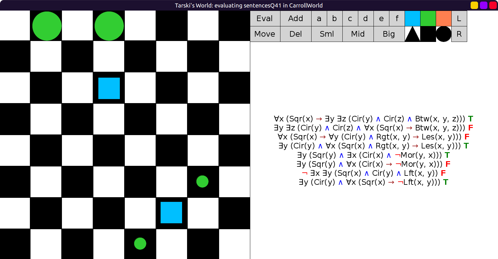

# 41 - solution

```scala
val sentencesQ41 = Seq(
  fof"∀x (Sqr(x) → ∃y ∃z (Cir(y) ∧ Cir(z) ∧ Btw(x, y, z)))",
  fof"∃y ∃z (Cir(y) ∧ Cir(z) ∧ ∀x (Sqr(x) → Btw(x, y, z)))",
  fof"∀x (Sqr(x) → ∀y ((Cir(y) ∧ Rgt(x, y)) → Les(x, y)))",
  fof"∃y (Cir(y) ∧ ∀x ((Sqr(x) ∧ Rgt(x, y)) → Les(x, y)))",
  fof"∃y (Sqr(y) ∧ ∃x (Cir(x) ∧ ¬Mor(y, x)))",
  fof"∃y (Sqr(y) ∧ ∀x (Cir(x) → ¬Mor(y, x)))",
  fof"¬ ∃x ∃y (Sqr(x) ∧ Cir(y) ∧ Lft(x, y))",
  fof"∃y (Cir(y) ∧ ∀x (Sqr(x) → ¬Lft(x, y)))"
)
```

1. Every square is between a pair of circles.

    The ambiguity comes from the interpretation of "a pair of circles".
    It can refer to a specific pair of circles that applies universally,
    or multiple, separate pairs of circles, each corresponding to an individual square.

    This is ambiguous because it could be interpreted as:

    - For each individual square `x`,
      there is a corresponding pair of circles, say `xa` and `xb`,
      such that `x` is between `xa` and `xb`.
      Meaning, for another square `y` there would be another pair of circles,
      call them `ya` and `yb`, not necessarily the same as `xa` and `xb`,
      such that `y` is between `ya` and `yb`.
    - There is a pair of circles `c1` and `c2` such that
      *all squares* are in between `c1` and `c2`.

    These are translated as:
    - ∀x (Sqr(x) → ∃y ∃z (Cir(y) ∧ Cir(z) ∧ Btw(x, y, z)))
    - ∃y ∃z (Cir(y) ∧ Cir(z) ∧ ∀x (Sqr(x) → Btw(x, y, z)))

2. Every square to the right of a circle is smaller than it is.

    The ambiguity comes from "a circle", it could mean one specific circle
    that applies universally, or multiple separate circles, each corresponding
    to an individual square.

    This is ambiguous because it could be interpreted as:

    - For every square `x`, if `x` is to the right of a circle `y`,
      then `x` is smaller than `y`.
    - There is a circle `y` such that for every square `x`,
      if `x` is to the right of `y`, then `x` is smaller than `y`.

    These are translated as:
    - ∀x (Sqr(x) → ∀y ((Cir(y) ∧ Rgt(x, y)) → Les(x, y)))
    - ∃y (Cir(y) ∧ ∀x ((Sqr(x) ∧ Rgt(x, y)) → Les(x, y)))

3. Some square is not bigger than every circle.

    The ambiguity comes from "not bigger than every".
    It could mean "it is not the case that it is bigger than every",
    or "it is the case that it is non-bigger-than every".

    This is ambiguous because it could be interpreted as:

    - There is a square `y` such that it is not the
      case that `y` is bigger than every circle.
      In other words, there is a circle `x` such that `y` is not bigger than `x`.
    - There is a square `y` such that for every circle `x`, `y` is not bigger than `x`.

    These are translated as:
    - ∃y (Sqr(y) ∧ ∃x (Cir(x) ∧ ¬Mor(y, x)))
    - ∃y (Sqr(y) ∧ ∀x (Cir(x) → ¬Mor(y, x)))

4. No square is to the left of some circle.

    The ambiguity comes from "some circle", it could mean one specific circle
    that applies universally, or multiple separate circles, each corresponding
    to an individual square.

    This is ambiguous because it could be interpreted as:

    - It is not the case that there is a square `x` and some circle `y`
      such that `x` is to the left of `y`.
    - There is a circle `y` such that for every square `x`, `x` is not to the left of `y`.

    These are translated as:
    - ¬ ∃x ∃y (Sqr(x) ∧ Cir(y) ∧ Lft(x, y))
    - ∃y (Cir(y) ∧ ∀x (Sqr(x) → ¬Lft(x, y)))

Comes out T/F/F/T/T/F/F/T in `CarrollWorld`:



## Optional sentence

1. (At least) two squares are between (at least) two circles.

    The ambiguity comes from "two circles".
    Let's assume there are at least two squares, `x` and `y`.

    It could mean that there are (at least) two circles `u` and `v` such that
    both `x` and `y` are between `z` and `u`, in other words,
    `x` is between `u` and `v`, and `y` is also between `u` and `v`.
    (In other words, think of the two circles as being "universal" for all the squares.)

    It could also mean that there are two circles `xa, xb` corresponding to `x`
    and two circles `ya, yb` corresponding to `y`, not necessarily the same as `xa, xb`,
    such that `x` is between `xa, xb` and `y` is between `ya, yb`.

    These can be translated as:
    - ∃u ∃v (
        Cir(u) ∧ Cir(v) ∧ u != v ∧
        ∃x ∃y (Sqr(x) ∧ Sqr(y) ∧ x != y ∧ Btw(x, u, v) ∧ Btw(y, u, v))
      )
    - ∃x ∃y (
        Sqr(x) ∧ Sqr(y) ∧ x != y ∧
        ∃z ∃u (Cir(z) ∧ Cir(u) ∧ Btw(x, z, u)) ∧
        ∃v ∃w (Cir(v) ∧ Cir(w) ∧ Btw(y, v, w))
      )
