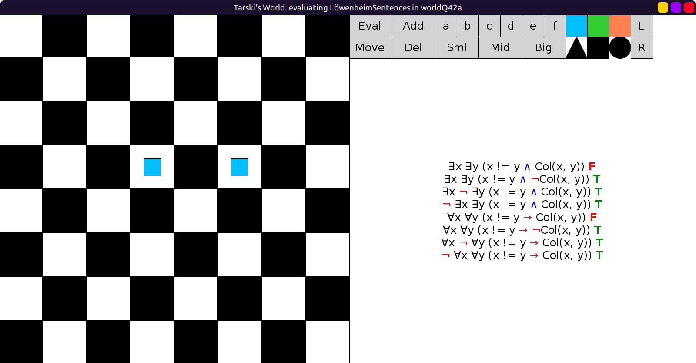
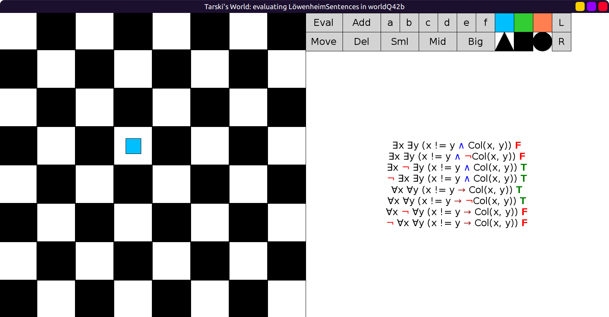
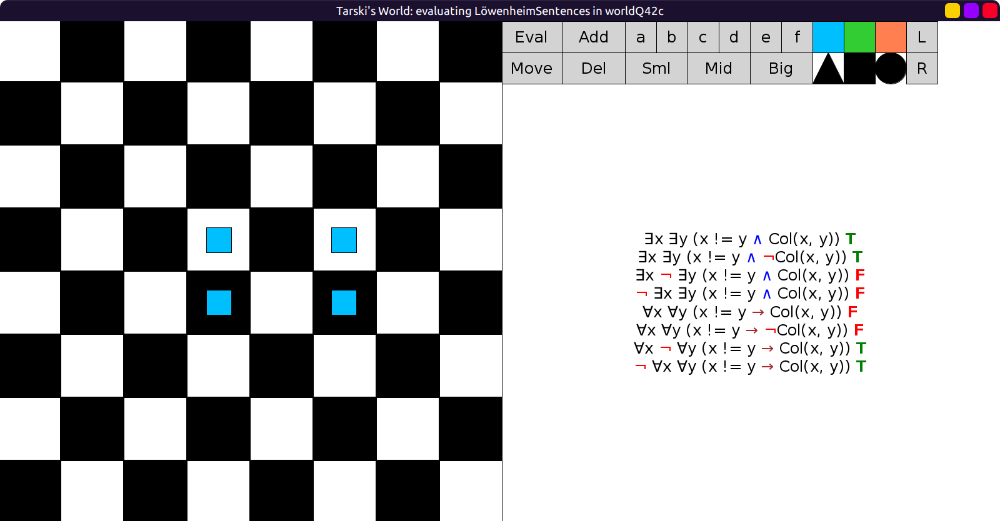
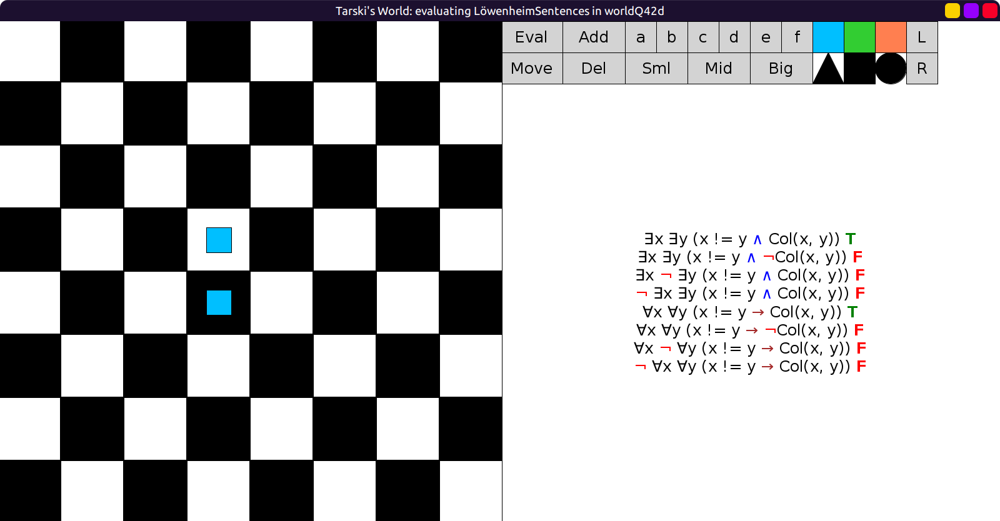

# 42 - solution

## English renditions

Here are English renditions:

```scala
val LöwenheimSentences = Seq(
  fof"∃x ∃y (x != y ∧ Col(x, y))",   // some of the parties are not lonely
  fof"∃x ∃y (x != y ∧ ¬Col(x, y))",  // there is more than 1 party
  fof"∃x ¬ ∃y (x != y ∧ Col(x, y))", // some party is lonely
  fof"¬ ∃x ∃y (x != y ∧ Col(x, y))", // every party is lonely
  fof"∀x ∀y (x != y → Col(x, y))",   // there is at most 1 party
  fof"∀x ∀y (x != y → ¬Col(x, y))",  // every party is lonely
  fof"∀x ¬ ∀y (x != y → Col(x, y))", // every party excludes someone
  fof"¬ ∀x ∀y (x != y → Col(x, y))"  // there is more than 1 party
)
```

## Equivalences

2 is equivalent to 8, and 5 is equivalent to the negation of 2.

4 is equivalent to 6, and 1 is equivalent to the negation of 4.

## Independence of 3 and 7

3 and 7 both true:

```scala
val worldQ42a: Grid = Map(
  (3, 3) -> Block(Sml, Sqr, Blu),
  (3, 5) -> Block(Sml, Sqr, Blu)
)
```

3 is true because there is at least one lonely party.
7 is true because there are two parties, which means every party excludes someone.



3 true, 7 false (there is only 1 party, lonely):

```scala
val worldQ42b: Grid = Map(
  (3, 3) -> Block(Sml, Sqr, Blu)
)
```

3 is true because there is at least one lonely party.
7 is false because there is only one party, so nobody is excluded,
which means there is a party that does not exclude someone.



3 false, 7 true (there are 2 parties, both not lonely):

```scala
val worldQ42c: Grid = Map(
  (3, 3) -> Block(Sml, Sqr, Blu),
  (4, 3) -> Block(Sml, Sqr, Blu),
  (3, 5) -> Block(Sml, Sqr, Blu),
  (4, 5) -> Block(Sml, Sqr, Blu)
)
```

3 is false because there are no lonely parties.
7 is true because there are two parties, so every party excludes someone.



3 and 7 both false (there is only 1 party, not lonely):

```scala
val worldQ42d: Grid = Map(
  (3, 3) -> Block(Sml, Sqr, Blu),
  (4, 3) -> Block(Sml, Sqr, Blu)
)
```

3 is false because there are no lonely parties.
7 is false because there is only one party, so nobody is excluded,
which means there is a party that does not exclude someone.


