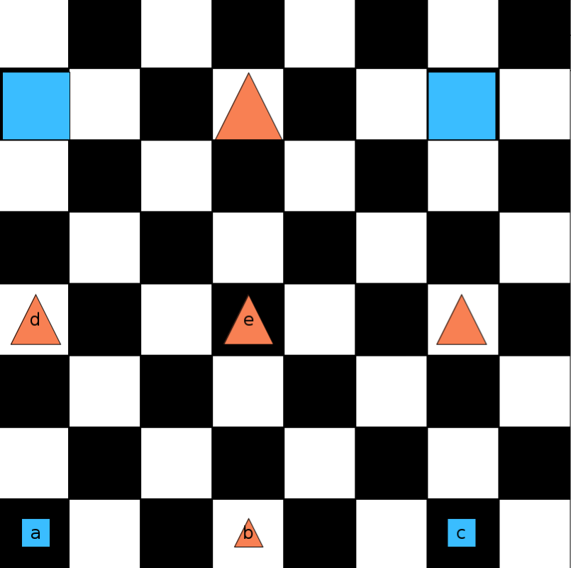

# 44 - Evaluating sentences in a world

- See `ZornSentences` which will be evaluated in `LeibnizWorld`:

    

- The sentences contain both quantifiers and the identity + equality symbols.
- Work through them, assessing their truth and playing the game when necessary.
- After you're sure you understand why the sentences get the values they do,
  modify the false ones to make them true.
- You can make any change you want except adding or deleting a negation sign.
  (This includes adding or deleting the negation `!` which occurs in `!=`.)

## Historical: who was Zorn?

German mathematician (1906 - 1993)

Many contributions to algebra, known for Zorn's Lemma (related to Axiom of Choice).

Student of Artin.

<https://en.wikipedia.org/wiki/Max_August_Zorn>
