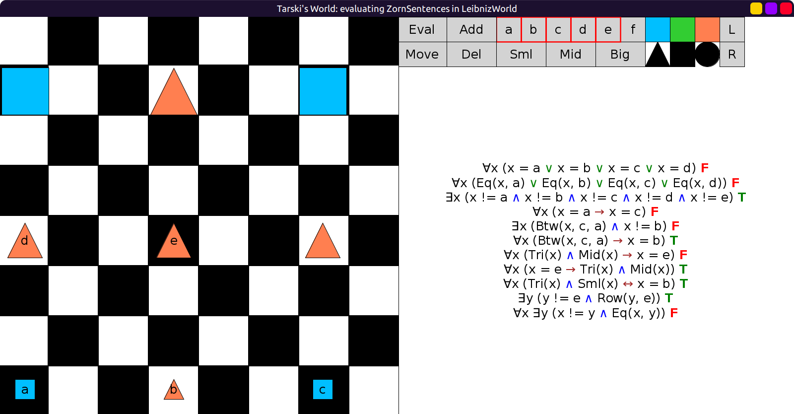
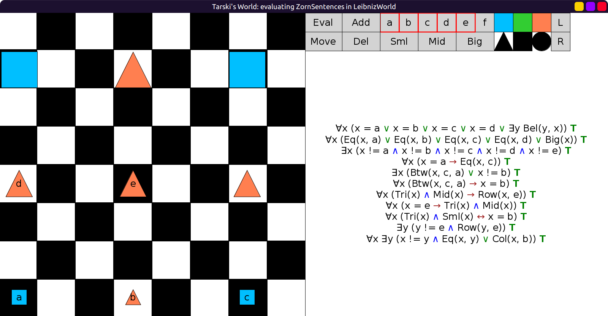

# 44 - solution

```scala
val ZornSentences = Seq(
  // fof"∀x (x = a | x = b | x = c | x = d)", change to:
  fof"∀x (x = a | x = b | x = c | x = d | ∃y Bel(y, x))",
  // fof"∀x (Eq(x, a) | Eq(x, b) | Eq(x, c) | Eq(x, d))", change to:
  fof"∀x (Eq(x, a) | Eq(x, b) | Eq(x, c) | Eq(x, d) | Big(x))",
  fof"∃x (x != a ∧ x != b ∧ x != c ∧ x != d ∧ x != e)",
  // fof"∀x (x = a → x = c)", change to:
  fof"∀x (x = a → Eq(x, c))",
  // fof"∃x (Btw(x, c, a) ∧ x != b)", change to:
  fof"∃x (Btw(x, c, a) | x != b)",
  fof"∀x (Btw(x, c, a) → x = b)",
  // fof"∀x (Tri(x) ∧ Mid(x) → x = e)", change to:
  fof"∀x (Tri(x) ∧ Mid(x) → Row(x, e))",
  fof"∀x (x = e → Tri(x) ∧ Mid(x))",
  fof"∀x (Tri(x) ∧ Sml(x) ↔ x = b)",
  fof"∃y (y != e ∧ Row(y, e))",
  // fof"∀x ∃y (x != y ∧ Eq(x, y))" change to:
  fof"∀x ∃y (x != y ∧ Eq(x, y) | Col(x, b))"
)
```

Before:



After:


