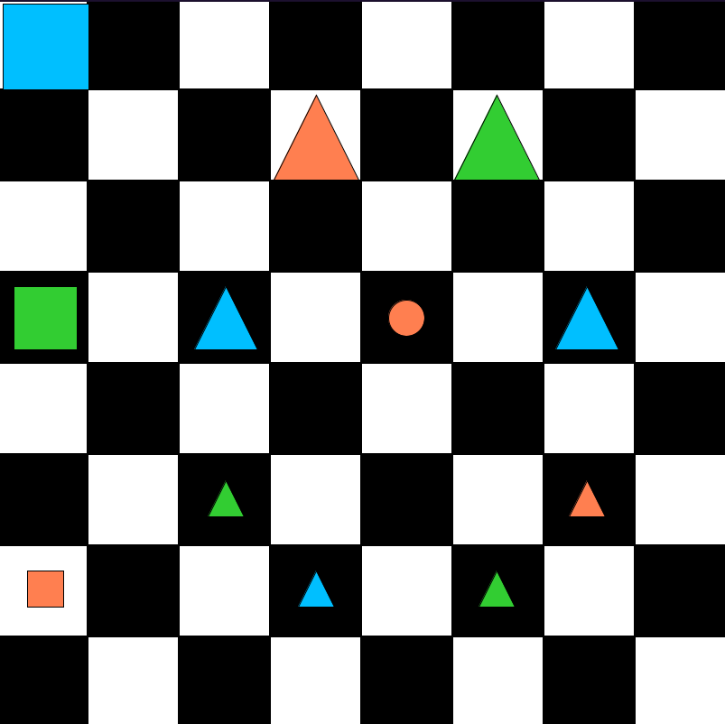

# 46 - Describing a world

- Let's try our hand describing a world using multiple quantifiers.
- See `FinslerWorld`:

    

1. Notice that all the small blocks are below all the big blocks.
  Use your first sentence to say this.
2. With your second sentence, point out that there's a
  square that is bigger than a triangle.
3. Next, say that all the squares are in the same column.
4. Notice, however, that this is not true of the triangles. So write the
  same sentence about the triangles, but put a negation sign out front.
5. Every square is also in a different row from every other square. Say this.
6. Again, this isn't true of the triangles, so say that it's not.
7. Notice there are non-identical triangles that are the same size. Express this fact.
8. But there aren't non-identical squares of the same size, so say that, too.
9. Notice there is a red block that is between two other blocks of the same tone.
10. But there is no lime or blue block that is between two other blocks of the same tone.

- Are all your translations true in `FinslerWorld`?
- If not, try to figure out why.
- In fact, play around with the world and see if your first-order sentences
  always have the same truth values as the claims you meant to express.
- Check them out in `KönigWorld`, where all of the original claims are false.
- Are your sentences all false? When you think you've got them right, save.

## Historical: who were Finsler and König?

Paul Finsler, German-Swiss mathematician (1894 - 1970)

Contributions to differential geometry,
also worked on foundations (Non-well-founded set theory) to resolve Russell's Paradox.

<https://en.wikipedia.org/wiki/Paul_Finsler>

### Many Königs

There are many mathematicians named König.
(slightly different spellings in Hungarian and German)

Gyula Kőnig, Hungarian mathematician (1849 – 1913)

Contributions to complex analysis and set theory.

Known for Kőnig's theorem and Kőnig's paradox.

<https://en.wikipedia.org/wiki/Gyula_K%C5%91nig>

and his son, Dénes Kőnig (1884 - 1944)

Major contributions to graph theory, wrote its first textbook.

<https://en.wikipedia.org/wiki/D%C3%A9nes_K%C5%91nig>

Johann Samuel König, German mathematician (1712 – 1757)

Known for König's theorem in kinetics and
disagreements with Euler on the principle of least action in physics.

<https://en.wikipedia.org/wiki/Johann_Samuel_K%C3%B6nig>

Robert König, Austrian mathematician (1885 - 1979)

Student of Hilbert.

<https://en.wikipedia.org/wiki/Robert_K%C3%B6nig>
