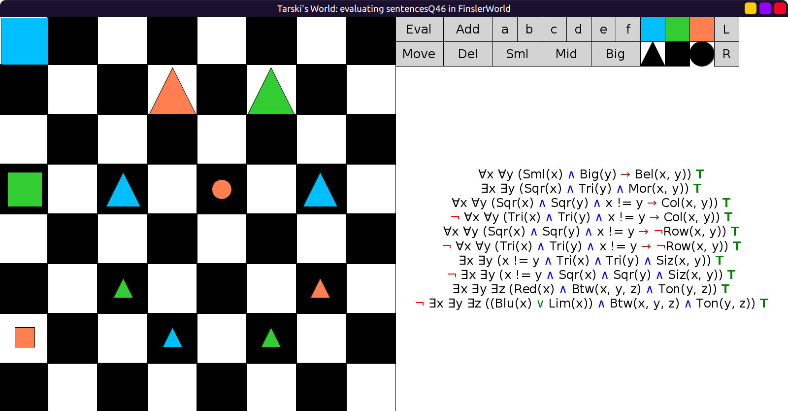
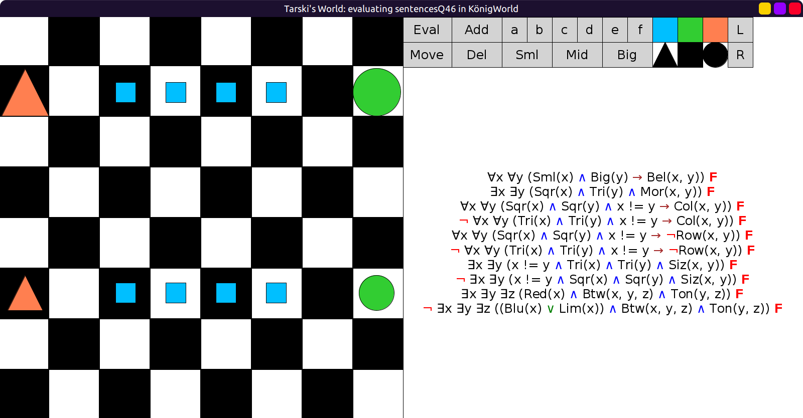

# 46 - solution

```scala
val sentencesQ46 = Seq(
  fof"∀x ∀y ((Sml(x) ∧ Big(y)) → Bel(x, y))",
  fof"∃x ∃y (Sqr(x) ∧ Tri(y) ∧ Mor(x, y))",
  fof"∀x ∀y ((Sqr(x) ∧ Sqr(y) ∧ x != y) → Col(x, y))",
  fof"¬ ∀x ∀y ((Tri(x) ∧ Tri(y) ∧ x != y) → Col(x, y))",
  fof"∀x ∀y ((Sqr(x) ∧ Sqr(y) ∧ x != y) → ¬Row(x, y))",
  fof"¬ ∀x ∀y ((Tri(x) ∧ Tri(y) ∧ x != y) → ¬Row(x, y))",
  fof"∃x ∃y (x != y ∧ Tri(x) ∧ Tri(y) ∧ Siz(x, y))",
  fof"¬ ∃x ∃y (x != y ∧ Sqr(x) ∧ Sqr(y) ∧ Siz(x, y))",
  fof"∃x ∃y ∃z (Red(x) ∧ Btw(x, y, z) ∧ Ton(y, z))",
  fof"¬ ∃x ∃y ∃z ((Blu(x) | Lim(x)) ∧ Btw(x, y, z) ∧ Ton(y, z))"
)
```

All true in `FinslerWorld`:



All false in `KönigWorld`:


