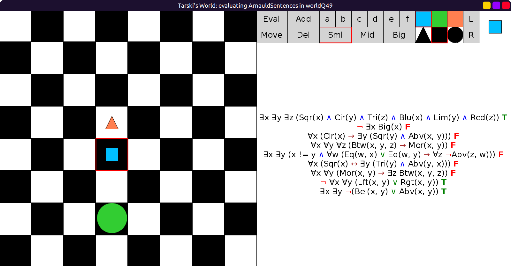

# 49 - solution

Last two sentences are always true (tautologies).
The first sentence is needed to be true (asserts the existence of 3 blocks).
One way we can make the rest false is this:

```scala
val worldQ49: Grid = Map(
  (3, 3) -> Block(Sml, Tri, Red),
  (4, 3) -> Block(Sml, Sqr, Blu),
  (6, 3) -> Block(Big, Cir, Lim)
)
```


