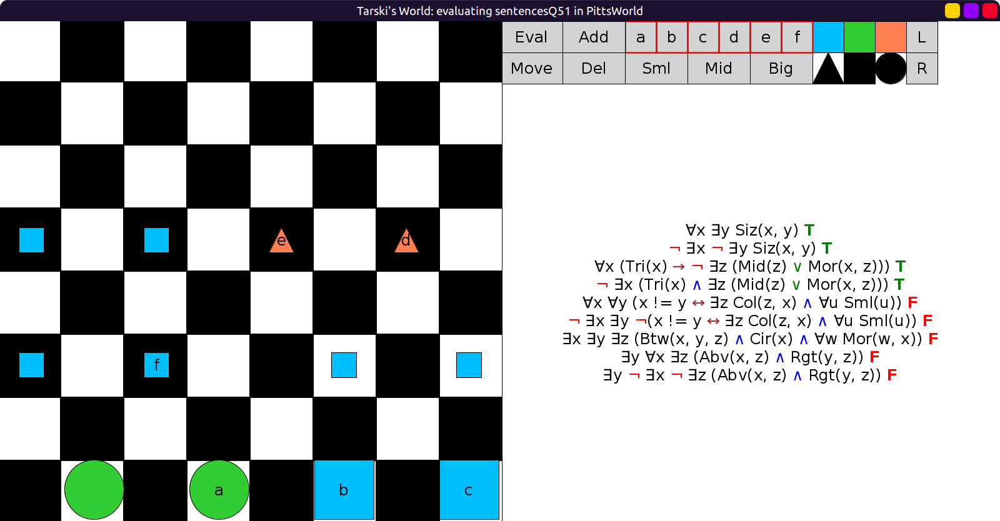
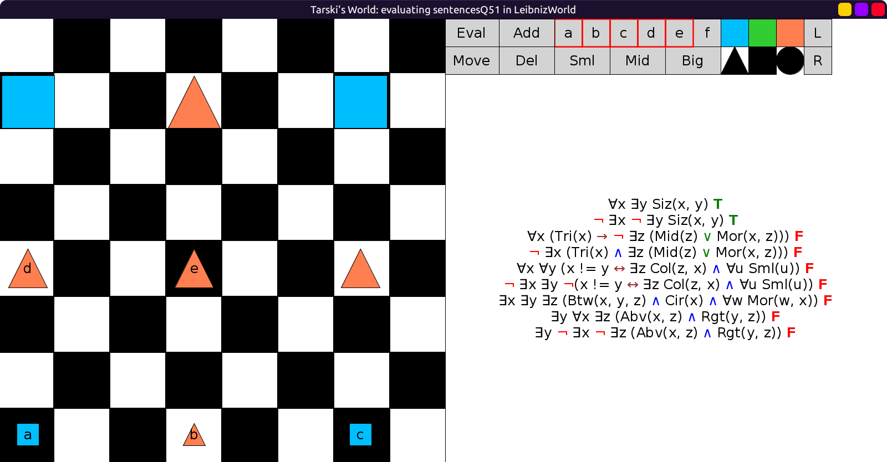

# 51 - solution

```scala
val sentencesQ51 = Seq(
  fof"∀x ∃y Siz(x, y)",
  fof"¬ ∃x ¬ ∃y Siz(x, y)",
  fof"∀x (Tri(x) → ¬ ∃z (Mid(z) ∨ Mor(x, z)))",
  fof"¬ ∃x (Tri(x) ∧ ∃z (Mid(z) ∨ Mor(x, z)))",
  fof"∀x ∀y (x != y ↔ (∃z Col(z, x) ∧ ∀u Sml(u)))",
  fof"¬ ∃x ∃y ¬(x != y ↔ (∃z Col(z, x) ∧ ∀u Sml(u)))",
  fof"∃x ∃y ∃z (Btw(x, y, z) ∧ Cir(x) ∧ ∀w Mor(w, x))",
  fof"∃x ∃y ∃z (Btw(x, y, z) ∧ Cir(x) ∧ ∀w Mor(w, x))",
  fof"∃y ∀x ∃z (Abv(x, z) ∧ Rgt(y, z))",
  fof"∃y ¬ ∃x ¬ ∃z (Abv(x, z) ∧ Rgt(y, z))",
)
```




